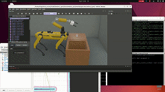

# Webots ROS2 Spot

This is a ROS 2 package to simulate the Boston Dynamics spot in [webots](https://cyberbotics.com/). Spot is able to walk around, to sit, standup and lie down. We also attached some sensors on spot, like a kincet and a 3D laser.
The world contains apriltags, a red line to test lane follower and soon objects for manipulation tasks.



## Prerequisites

    - Tested for ubuntu 22.04
    - ROS 2 humble
    - Webots R2023a
    - Webots ROS 2 interface

## Install

### Install dependencies
```
sudo apt install ros-$ROS_DISTRO-webots* ros-$ROS_DISTRO-nav2* -y
sudo apt install ros-$ROS_DISTRO-pointcloud-to-laserscan -y
sudo apt install ros-$ROS_DISTRO-moveit* -y
sudo apt install python3-open3d -y # for Ubuntu 22.04
pip3 install scipy pupil-apriltags
pip3 install open3d # for Ubuntu 20.04
```

### webots_ros2_spot
```
# Source ROS 2
source /opt/ros/$ROS_DISTRO/local_setup.bash

cd /path/to/ros2_ws
git clone https://github.com/MASKOR/webots_ros2_spot src/webots_spot

# spot_msgs
git clone https://github.com/MASKOR/webots_spot_msgs src/spot_msgs

# Build everything
colcon build --symlink-install
source install/local_setup.bash
```

## Start
Starting the simulation:

    ros2 launch webots_spot spot_launch.py

Starting MoveIt:

    ros2 launch webots_spot moveit_launch.py

Starting apriltag detection:

    ros2 run webots_spot apriltag_ros

To launch navigation with Rviz2:

    ros2 launch webots_spot nav_launch.py set_initial_pose:=true

To launch mapping with Slamtoolbox:

    ros2 launch webots_spot slam_launch.py

To launch mapping with RTABMAP: #https://github.com/introlab/rtabmap_ros

    ros2 launch webots_spot rtabmap_launch.py

Teleop keyboard:

    ros2 run spot_teleop spot_teleop_keyboard
